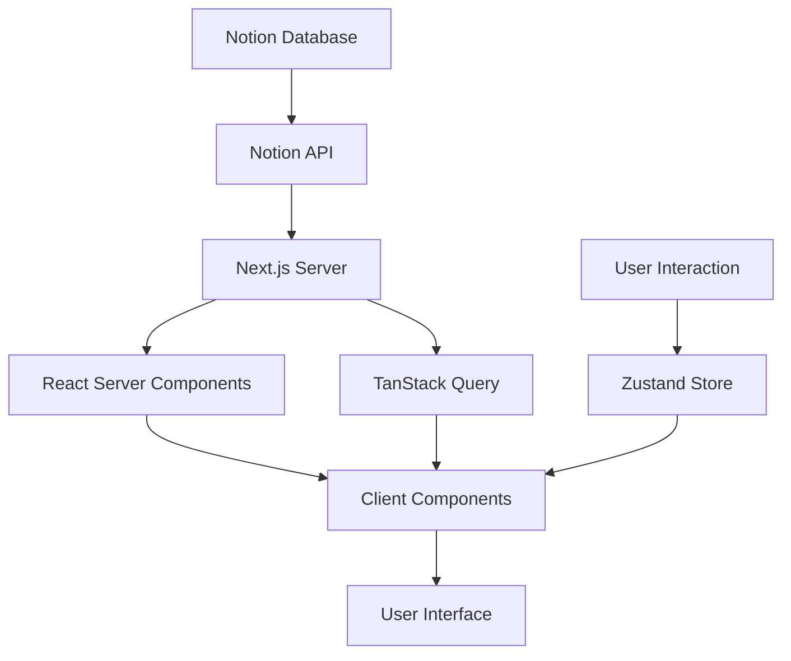

# 프론트엔드 개발자 포트폴리오 사이트 설계 문서

## 1. 프로젝트 개요

### 1.1 목적
- 프론트엔드 개발자의 개인 브랜딩 및 포트폴리오 전시
- 크몽을 통한 랜딩 페이지 제작 서비스 홍보
- 기술 블로그를 통한 전문성 어필
- 잠재 고객과의 원활한 소통 채널 구축

### 1.2 타겟 오디언스
- **주요 타겟**: 크몽을 통해 랜딩 페이지 제작을 의뢰하려는 고객
- **부가 타겟**: 향후 해외 클라이언트 확장 가능성 고려

### 1.3 핵심 기능
- 포트폴리오 전시 및 상세 정보 제공
- 기술 블로그 운영
- 다크/라이트 모드 지원
- Notion API를 통한 콘텐츠 관리
- 문의 및 연락 기능

## 2. 사이트 구조 (Information Architecture)

### 2.1 메인 네비게이션
```
Home (/)
├── About (/about)
├── Portfolio (/portfolio)
│   └── Portfolio Detail (/portfolio/[id])
├── Blog (/blog)
│   └── Blog Post (/blog/[slug])
└── Contact (/contact)
```

### 2.2 페이지별 구성

#### Home (메인 페이지)
- **Hero Section**: 인상적인 첫 인사 및 핵심 메시지
- **About Section**: 간단한 자기소개 및 기술 스택
- **Portfolio Section**: 주요 프로젝트 3-4개 미리보기
- **Blog Section**: 최신 블로그 포스트 3-4개
- **Contact Section**: 빠른 연락 방법 안내

#### About (소개 페이지)
- 프로필 사진 및 상세 소개
- 기술 스택 시각화
- 경력 및 이력 타임라인
- 작업 프로세스 소개
- 이력서 다운로드

#### Portfolio (포트폴리오 페이지)
- 프로젝트 카드 그리드 레이아웃
- 기술별/유형별 필터링
- 검색 기능
- 무한 스크롤 또는 페이지네이션

#### Portfolio Detail (포트폴리오 상세)
- 프로젝트 개요
- 사용 기술 및 역할
- 주요 기능 설명
- 스크린샷/데모
- GitHub/라이브 링크

#### Blog (블로그 페이지)
- 카테고리별 분류
- 태그 클라우드
- 검색 기능
- 최신순/인기순 정렬

#### Blog Post (블로그 포스트)
- 마크다운 렌더링
- 목차 (Table of Contents)
- 댓글 (Giscus)
- 관련 포스트
- 공유 기능

#### Contact (연락처 페이지)
- 연락처 정보
- 간단한 문의 폼 (선택적)
- SNS 링크
- 자주 묻는 질문

## 3. 기술 아키텍처

### 3.1 프로젝트 구조
```
fullkeem_portfolio/
├── app/                    # Next.js App Router
│   ├── (routes)/          # 라우트 그룹
│   ├── api/               # API 라우트
│   └── layout.tsx         # 루트 레이아웃
├── components/            # 재사용 가능한 컴포넌트
│   ├── common/           # 공통 컴포넌트
│   ├── home/             # 홈페이지 섹션
│   ├── portfolio/        # 포트폴리오 관련
│   └── blog/             # 블로그 관련
├── lib/                   # 유틸리티 함수
│   ├── notion.ts         # Notion API 클라이언트
│   └── utils.ts          # 공통 유틸리티
├── hooks/                 # 커스텀 훅
├── store/                 # Zustand 스토어
├── types/                 # TypeScript 타입 정의
├── styles/                # 글로벌 스타일
└── public/               # 정적 파일
```

### 3.2 데이터 플로우



### 3.3 Notion 데이터베이스 구조

#### Portfolio Database
```typescript
interface PortfolioItem {
  id: string;
  title: string;
  description: string;
  thumbnail: string;
  technologies: string[];
  projectType: 'website' | 'landing' | 'webapp' | 'mobile' | 'other';
  liveUrl?: string;
  githubUrl?: string;
  featured: boolean;
  published: boolean;
  order: number;
  createdAt: Date;
}
```

#### Blog Database
```typescript
interface BlogPost {
  id: string;
  title: string;
  slug: string;
  excerpt: string;
  category: string;
  tags: string[];
  coverImage?: string;
  publishedAt: Date;
  featured: boolean;
  published: boolean;
  viewCount: number;
  readingTime: number;
}
```

## 4. 디자인 시스템

### 4.1 디자인 원칙
- **미니멀리즘**: 깔끔하고 집중된 디자인
- **인터랙티브**: 섬세한 애니메이션과 마이크로 인터랙션
- **접근성**: WCAG 2.1 AA 기준 준수
- **반응형**: 모바일 퍼스트 접근

### 4.2 컬러 시스템
```css
/* CSS Variables */
:root {
  /* Light Mode */
  --background: 0 0% 100%;
  --foreground: 0 0% 0%;
  --primary: 217 100% 50%;
  --secondary: 0 0% 96%;
  --accent: 217 100% 50%;
  --muted: 0 0% 96%;
  --border: 0 0% 90%;
}

.dark {
  /* Dark Mode */
  --background: 0 0% 0%;
  --foreground: 0 0% 100%;
  --primary: 217 100% 60%;
  --secondary: 0 0% 10%;
  --accent: 217 100% 60%;
  --muted: 0 0% 15%;
  --border: 0 0% 20%;
}
```

### 4.3 타이포그래피
- **Heading**: Pretendard (한글), Inter (영문)
- **Body**: Pretendard (한글), Inter (영문)
- **Code**: JetBrains Mono

### 4.4 애니메이션 패턴
```typescript
// GSAP 스크롤 트리거
gsap.timeline({
  scrollTrigger: {
    trigger: element,
    start: "top 80%",
    end: "bottom 20%",
    toggleActions: "play pause resume reverse"
  }
});

// Framer Motion 페이지 전환
const pageVariants = {
  initial: { opacity: 0, y: 20 },
  animate: { opacity: 1, y: 0 },
  exit: { opacity: 0, y: -20 }
};
```

## 5. 컴포넌트 설계

### 5.1 공통 컴포넌트

#### Header
```typescript
interface HeaderProps {
  transparent?: boolean;
  fixed?: boolean;
}
```
- 스크롤 시 배경 변화
- 모바일 햄버거 메뉴
- 다크모드 토글

#### Footer
- 소셜 링크
- 빠른 메뉴
- 저작권 정보

#### ThemeToggle
- 시스템 테마 감지
- localStorage 저장
- 부드러운 전환 효과

### 5.2 홈페이지 컴포넌트

#### HeroSection
- 타이핑 애니메이션
- 배경 그라데이션 효과
- CTA 버튼

#### AboutSection
- 기술 스택 비주얼라이제이션
- 호버 효과
- 스크롤 애니메이션

#### PortfolioSection
- 카드 호버 효과
- Featured 프로젝트 강조
- "더 보기" 링크

### 5.3 포트폴리오 컴포넌트

#### PortfolioCard
```typescript
interface PortfolioCardProps {
  title: string;
  description: string;
  thumbnail: string;
  technologies: string[];
  href: string;
}
```

#### PortfolioFilter
- 기술 스택별 필터
- 프로젝트 유형별 필터
- 실시간 필터링

### 5.4 블로그 컴포넌트

#### BlogCard
- 카테고리 뱃지
- 읽기 시간 표시
- 호버 효과

#### TableOfContents
- 현재 위치 하이라이트
- 스무스 스크롤
- 모바일 토글

#### Comments (Giscus)
- GitHub Discussions 연동
- 다크모드 자동 감지

## 6. 성능 최적화

### 6.1 이미지 최적화
- Next.js Image 컴포넌트 활용
- WebP/AVIF 포맷 자동 변환
- Lazy loading
- Blur placeholder

### 6.2 코드 최적화
- Dynamic imports
- Tree shaking
- Bundle splitting
- CSS purging

### 6.3 SEO 최적화
```typescript
// Metadata API
export const metadata: Metadata = {
  title: {
    default: 'Frontend Developer | fullkeem',
    template: '%s | fullkeem'
  },
  description: '프론트엔드 개발자 포트폴리오',
  openGraph: {
    // OG tags
  },
  twitter: {
    // Twitter cards
  }
};
```

### 6.4 캐싱 전략
- ISR (Incremental Static Regeneration)
- React Query 캐싱
- 브라우저 캐싱 헤더

## 7. 보안 고려사항

### 7.1 환경 변수
- API 키 서버사이드 보관
- 클라이언트 노출 최소화

### 7.2 입력 검증
- 문의 폼 XSS 방지
- Rate limiting

### 7.3 의존성 관리
- 정기적인 업데이트
- 보안 취약점 스캔

## 8. 접근성 (a11y)

### 8.1 키보드 네비게이션
- Tab 순서 관리
- Focus 표시
- Skip links

### 8.2 스크린 리더
- Semantic HTML
- ARIA labels
- 이미지 alt 텍스트

### 8.3 색상 대비
- WCAG AA 기준 충족
- 다크모드에서도 충분한 대비

## 9. 테스트 전략

### 9.1 단위 테스트
- 유틸리티 함수
- 커스텀 훅
- 스토어 로직

### 9.2 통합 테스트
- API 라우트
- Notion API 연동

### 9.3 E2E 테스트
- 주요 사용자 플로우
- 반응형 테스트
- 크로스 브라우저

## 10. 배포 및 모니터링

### 10.1 배포 프로세스
- Git push → Vercel 자동 배포
- Preview deployments
- Production deployment

### 10.2 모니터링
- Vercel Analytics
- Google Analytics 4
- Sentry (에러 트래킹)

### 10.3 성능 모니터링
- Core Web Vitals
- Lighthouse CI
- 실사용자 지표

## 11. 향후 확장 계획

### Phase 1 (MVP) - 3-4주
- 기본 페이지 구조
- Notion API 연동
- 포트폴리오/블로그 기능
- 다크모드

### Phase 2 - 추가 2주
- 고급 애니메이션
- 댓글 시스템
- 검색 최적화
- 성능 튜닝

### Phase 3 - 추가 개발
- 다국어 지원
- 뉴스레터
- 방문자 분석
- A/B 테스팅
